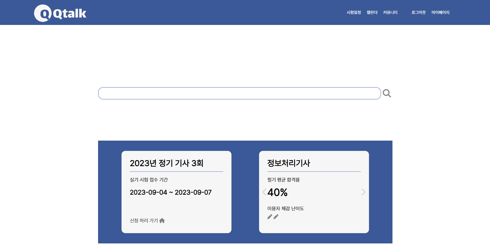
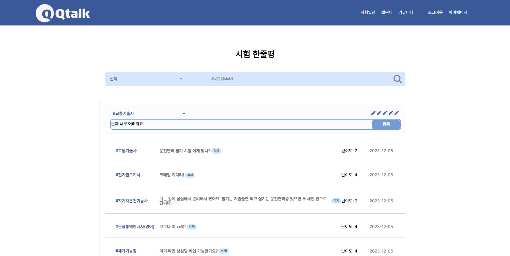
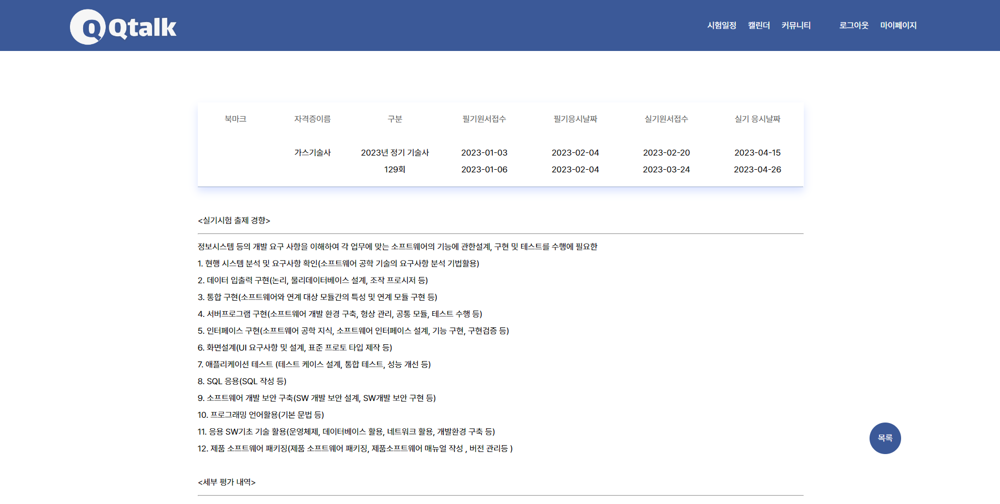
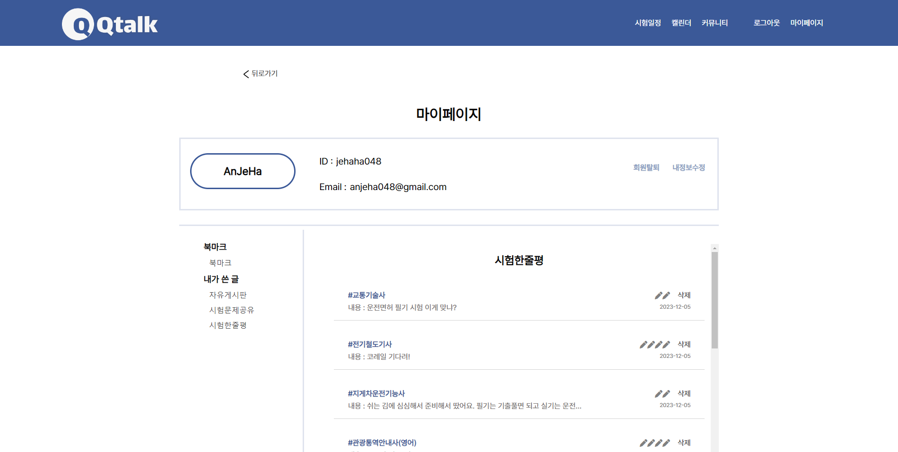
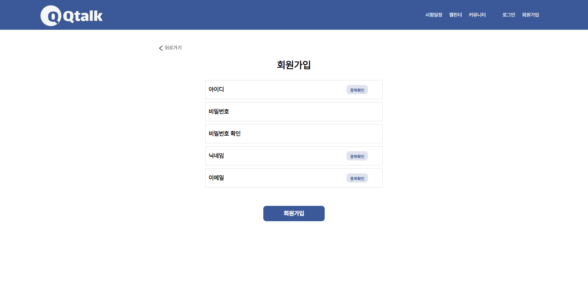
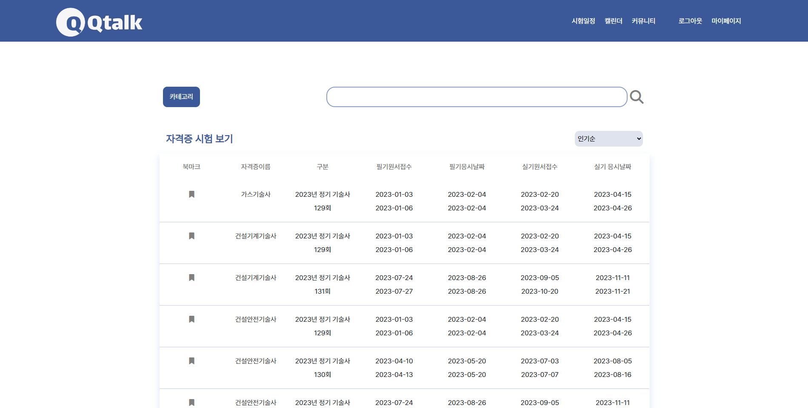

# Qtalk
&nbsp; 국가 공인 자격증 시험 정보 및 후기 공유 사이트
## 📖 상세 내용

> Qtalk은 KOSTA 교육과정에서 진행한 프로젝트입니다. Qtalk은 국가 공인 시험의 정보를 제공해 주고, 시험 관련 정보를 이용자들 간 공유하는 서비스입니다. 지금 접수 할 수 있는 시험 정보 또는 지원 자격 등을 한눈에 보고 싶다는 아이디어에서 시작했습니다. 국가 공인 시험의 정보를 볼 수 있고, 특정 시험을 본 이용자의 후기(난이도)와 시험 문제 또는 시험 팁을 공유받을 수 있습니다.

## 🛠️ 사용 기술 및 라이브러리
- JSP, Javascript, JQuery, Ajax, JSTL
- Java, Servlet, MyBaties, JDBC
- MariaDB
- Github

## 📱 담당한 기능
- 메인 페이지의 시험 일정이 임박한 시험 정보 제공 기능
- 후기가 많은 시험의 평균 합격률과 사용자들이 작성한 난이도의 평균 정보 제공 기능
- 게시판(시험 한 줄 평, 난이도) 및 검색 기능
- 마이페이지 기능(내 정보 수정, 회원 탈퇴, 내가 쓴 글 모아보기)
- 로그인, 회원가입 기능
- MVC 패턴 적용

## 💡 깨달은 점
- 프로젝트 설계 단계에서 많은 시간을 들이고 팀원들과 많은 소통을 해야함.
- Github Issue, PR, Review 등을 적극적으로 활용해야 함.
- 자격증 정보를 보여줄 때 약 600개의 자격증 시험 정보 리스트를 한 번에 가져와서 보여주기 때문에 사이트가 느려짐 이를 해결하기 위해 무한 스크롤 기능을 사용해 사용자에게 원할한 서비스를 제공해야 함.

  

